There are two types of problems in supervised learning:
- Regression
- Classification

## 1. Classification:
In classification problems, an unknown category called *class label* is to be predicted. For example, a yes/no question is a classification problem because there are two possible outcomes either *yes* or *no*. Further, a yes/no question is also called a *binary classifiers* as there are only two possible *target variable*. However, if there are more than 2 *target variables*, it is called *multiclass classifiers*.

## 2. Regression:
In regression, we try to predict an unknown number based on the set of known variables. For example, regression can be used to predict the price of a house based on the features i.e crime rate, ocean proximity, floor location, floor  etc. Here, the features such as crime rate, ocean proximity, floor location, floor size can be called as *input variables*. Furthermore, the value to be predicted can be called as *label* or *target variable* or *class label* or *output variable*. 

## 3. Machine Learning Pipelines
There are 4 major steps in the machine learning pipelines:

- Step I &rarr; Data Extraction
- Step II &rarr; Data Preparation
- Step III &rarr; Model Building
- Step IV &rarr; Model Deployment

## 4. ML Pipeline: Example
Here, we are going to explain Step III by building a model that predicts the target variable — type of a fruit — based on its features — height and width. We are given a synthetic table: 

| Height | Weight | Fruit Type |
| ------ | ------ | ---------- |
| 3.91   | 5.76   | Mandarin   |
| 7.09   | 7.69   | Apple      |
| 10.48  | 7.32   | Lemon      |
| 9.21   | 7.20   | Lemon      |
| 7.95   | 5.90   | Lemon      |
| 7.62   | 7.51   | Apple      |
| 7.95   | 5.32   | Mandarin   |
| 4.69   | 6.19   | Mandarin   |
| 7.50   | 5.99   | Lemon      |
| 7.11   | 7.02   | Apple      |
| 4.15   | 5.60   | Mandarin   |
| 7.29   | 8.38   | Apple      |
| 8.49   | 6.52   | Lemon      |
| 7.44   | 7.89   | Apple      |
| 7.86   | 7.60   | Apple      |
| 3.93   | 6.12   | Apple      |
| 4.40   | 5.90   | Mandarin   |
| 5.50   | 4.5    | Lemon      |
| 8.10   | 6.15   | Lemon      |
| 8.69   | 5.82   | Lemon      |

### 4.1. Problem Representaion
There are two *features* present in our dataset — height and width. The number of features per data point is represented by $p$. In our case, $p=2$. These features can be represented by the vector $x=(x^{(1)},..x^{(p)})$. The superscript $x^{(j)}$ represents the $j^{th}$ input feature. The number of data points is represented by $n$. In the table above, there are twenty data points. So, $n=20$. And each datapoint is represented by $i$. Each data point $(i)$ is represented by the vector $x_i=(x_i^{(1)},..x_i^{(p)})$.

So, the vector for the $3^{rd}$ data point can be represented as:
$$x_3=(x_3 ^{(1)},x_3 ^{(2)} )=(10.48,7.32)$$

The *target variable*$(y)$ takes discrete set of values. In our case, $y \in \{Mandarin, Apple, Lemon\}$. The *output variable*$(y)$ of $i^{th}$ data point is represented as $y_i$. In our table, the output variable of $3^{rd}$ data point can be represented as:
$$y_3 = Lemon$$

### 4.2. Data Visualization
For classification problem with two *input variables* it is often visualized with a ***scatter plot***. 

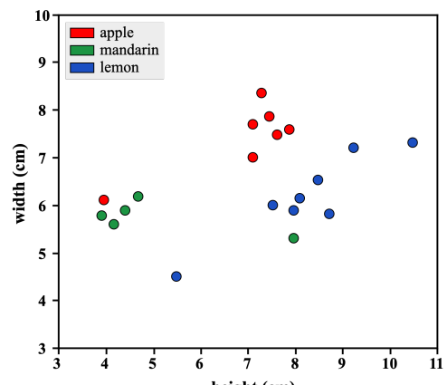

<i>Figure 1: Scatter-plot</i>

<u>For the scatter plot:</u>
- $x-axis$ &rarr; 1st Feature
- $y-axis$ &rarr; 2nd Feature
- $i^{th}$ data point &rarr; each dot $(x_i^{(1)}, x_i^{(2)})$ colored according to the class label.

### 4.3. Learning Prediction Function
Our prediction is carried out by the function we define $f$. Different algorithms corresponds to the different type of prediction function. We focus on KNN algorithm for now. 

KNN classifies a new point $x$ by finding the $k$ points in the training data that are nearest to the point $x$. Then, it will choose class $y$ for each point $x$ as the most popular class among these nearest point.

In our case, we are going to give $k=1$ which will calculate 1 nearest neighbors and classify $x$ as of that class. 

### 4.4. Visualizing the Decision Regions
In the aforementioned Figure 1, each region/cluster of the same color is called *decision region* for each class and the curve that makes up the boundary between these decision regions is called *decision boundary*.

## 5. Evaluating the Prediction Function
We start by defining a numeric metric that tells us how good a classifier function is on a data set. First, we evaluate our classifier function on the dataset we trained it on and secondly, we test it on a new dataset.

We find out that our function performed exceptionally well on our training dataset. Which is not a realistic estimation of real world error. This problem is called overfitting.

### 5.1. Loss Function
First, we find out that how well does our prediction function matches with the *true label* with a single number. Lets, calculate the *misclassification rate*$(L)$ by dividing the total number of misclassifications with the total number of data points$(n)$. 

$$L(f,X,Y)=\frac{1}{n}\sum_{i=1}^{n}[f(x_i)\neq y_i]$$

Here, 
- $X = \{x_i: i=1,..n\}$
- $Y=\{y_i: y=1, ..n\}$
- $L =$ Misclassification Rate
- [] $=$ 1 if True, 0 if False

**Note:** If [] is 1 then we find that the prediction function is incorrect.

### 5.2. Evaluating on Train Data
Evaluating our prediction function on the training dataset gives the *misclassification rate* $L(f,X,Y)=0$. Because, each $f(x_i)=y_i$. Therefore, $[f(x_i)\neq y_i]=0$ and $\frac0n$ is 0.

### 5.3. Evaluating on Test Dataset

| Height(cm) | Width(cm) | Actual Fruit | Prediction Error? |
| ---------- | --------- | ------------ | ---------------- |
| 4          | 6.5       | Mandarin     | 1                |
| 4.7        | 7.13      | Mandarin     | 0                |
| 6.49       | 7         | Apple        | 0                |
| 7.51       | 5.01      | Lemon        | 1                |
| 8.34       | 4.23      | Lemon        | 1                | 

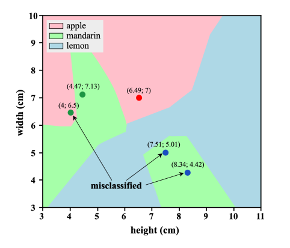

<i>Figure 2: Prediction graph for the test dataset.</i>

Since, our prediction function predicted only 2 of 5 fruits correctly, the misclassification rate on the new batch of fruit is $\frac{3}{5}$. 
$$L(f,X_{test},Y_{test})=\frac{3}{5}$$

### 5.4. Overfitting
While evaluating train data we got very low error(0% wrong). We got higher error on the test set(60 % wrong). This problem where the error is very low in the training set but much higher in an unseen data is known as *overfitting*.

## 6. Controlling Model Complexity
A fundamental problem in ML is to learn a model which neither *overfits* nor *underfits* the data. To achieve this for KNN classifier, we vary the value of $k$, the number of nearest neighbors used to classify a point.

The figure below shows the misclassification error rate for every value of $k$ from 1 to n for both train and test data. Looking at the figure we find out that the value of $k$ should be between 3 and 7—both included—for our model to optimally balance between overfitting and underfitting.

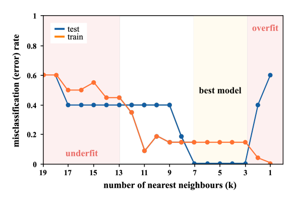

<i>Figure 3: Misclassification Error Rate for Train and Test set for all values of k.</i>

### 6.1. ML Pipelile: General Form
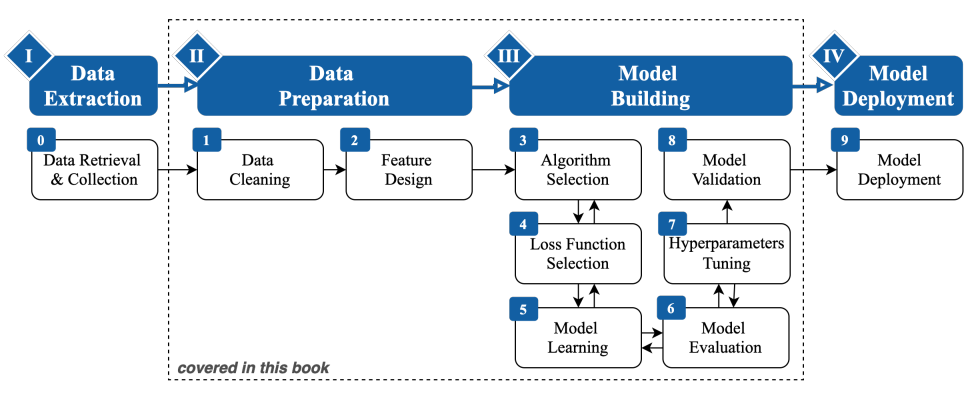

<u><b>Data Extraction:</b></u>
Extracting high quality data is important for our model to work optimally.

<u><b>Data Preparation:</b></u>
The Model Building Stage(Step III) assumes that our data is in idealized form. Meaning, our dataset is a clean table with one row for each data point.

- **Data Cleaning:**
Uncleaned/Raw datasets often have missing values, improperly scaled measurements, erroneous or outlier data points or non-numeric data structure like strings which cannot be fed into ML algorithms. The goal of cleaning data is to convert the raw data into clean structured numeric format.

- **Feature Design:**
Feature design is the technique used to improve ML model's performance by combining raw features into new features removing irrelevant features. Following are the feature design paradigms:

- **Feature Transformation:**
Converting human readable data into machine-interpretable data. For example, converting *yes* and *no* to *1* and *0*

- **Feature Engineering:**
Process of combining raw dataset *features* to create a *new feature*. For example, on our fruit dataset, we can create a new feature as ratio of height to width of a fruit. Finding good features require a lot of trial and error.

- **Feature Selection:**
Process of identifying and removing the features that are not required to the prediction problem. Removing useless features ensures better performing model on unseen data.

**<u><b>Model Building:</b></u>**
 After the pre-processing of data is complete we focus on building a good ML-model which predicts the label with less error on a new dataset.

- **Algorithm Selection:**
Next step is to select a *form* of prediction function $\hat f$. $\hat f$ should be chosen such that it accurately captures "true" function $f$. The "true" function $f$ is unknown. Different algorithms that we are going to further discuss are:
	1. Linear Polynomial Model
	2. Logit Model
	3. Bayesian Model
	4. Maximum margin Models
	5. Tree-based Models
	6. Ensemble Models

 - **Loss Function Selection**
 After selecting  a specific algorithm, we then need to decide on its loss function the method on which the algorithm would use to learn from data. For e.g., a linear regression model uses least square error loss function.

- **Model Learning**
Next step is to train the ML model. In brief, learning is just finding the set of parameters which minimizes the loss function on the training data.
 - **Model Evaluation**
Evaluating how well our trained model will perform on an unseen test dataset. In this process we split one large dataset into training and testing dataset and evaluate how the model performs on test data. 

- **Hyper-Parameter Tuning**
The process of training a dataset that balances the problems of unerfitting and overfitting. It is not possible to know which hyper parametes will work best. It is the process of testing multiple hyper-parametrs and choosing the one which performed with less errors.

- **Model Validation**
After all of the Data Preparation and Model Building steps, we must validate that our model performs as we expect. We test our model on totally seperate portion of data that we had set aside at the very beginning of the project.

## 7. Model Learning
For a ML model, a learning problem is nothing more than a mathematical optimization problem. A simple algorithm known as *Gradient Descent* algorithm is can be used to solve the optimization problem.

### 7.1 Linear Regression
#### 7.1.1 Linear Models
Suppose, we have a dataset with area and price of apartments. We have to predict the price of an apartment with know floor area size.

Here, relationship between the target variable $y$ (price) and the response variable $x$ (area) is a *linear relationship*. Linear relationship can be expressed as,

$$\hat f(x)=a.x+b$$
Where, 
- $\hat f$ = prediction function
- $x$ = response variable
- $y$ = target variable
- $a$ = coefficient of slope
- $b$ = point of intercept

Finding the line that best fits the data is known as *linear regression*. 

To find the best possible parameters for $a$ and $b$, we have two steps.
- First, we need to develop a *goodness-of-fit* metric which gives a score of how well the line fits our data.
- Second, we figure out how to search over all the possible values of $a$ and $b$ to find the best fit. *Gradient Descent* algorithm helps us achieve this.

#### 7.1.2 Goodness-of-fit
**Residuals** &rarr; Difference between actual value and the value that the model predicts for that particular observation/data point. Residual for linear model can be represented as,
$$r_i=y_i-\hat f(x_i)$$
Where, 
- $r_i$ = $i^{th}$ residual
- $y_i$ = actual target variable of $i^{th}$ data point.
- $\hat f(x_i)$ = predicted value for $i^{th}$ data pint.

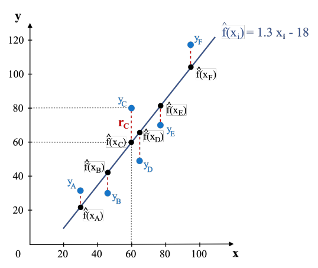

<i>Figure 5: Graph showing the residuals of each data point</i>

In the figure above, for the data point $c$,

$y_c = 80$ 
$\hat f(x_c) = 60$

Then, residue for the data point $c$ is,
$$
\begin{align}
r_c&=y_c - \hat f(x_c)\\
r_c&=80-60\\
r_c&=20
\end{align}
$$

So, the residual value for the data pont $c$ is 20.

After, finding out the residuals, we have to find out the error in the entire dataset. Most popular method os to compute the *squared error* or *sum of squared residuals(SSR)*.

$$
\begin{align}
SSR(\hat f) &=\sum_{i=1}^{n}(y_i - \hat f(x_i))^2 \\
&=\sum_{i=1}^{n} r_i^2
\end{align}
$$

The lower the value of SSR, it is a better fit. 

##### Parameterized SSR
Lets find the best possible value for $a$. Let us pretend that we know the value of $b$ as -18. So we have, $\hat f(x)=a.x-18$, a function with a single parameter $a$. The SSR function of parameter $a$ is,

$$
\begin{align}
SSR(a) &= \sum_{i=1}^{n}(y_i-\hat f(x_i))^2 \\
&=\sum_{i=1}^{n}(y_i-(a.x-18))^2
\end{align}
$$

Lets evulate SSR for $a=0.7$ on the apartment dataset.

$$
\begin{align}
SSR(a)&=\sum_{i=1}^{n}(y_i-(0.7x_i-18))^2 \\
&=(31-(0.7*30 - 18))^2+.... \\
&=10624.95
\end{align}
$$

Now, lets plot the calculated SSR values over changing parameter $a$ on the graph where the x-axis is the value of a and y-axis is the SSR value. In mathematical optimization, we represent the erros with a *cost function* denoted as $J$. In other words, $SSR(a)=J(a)$.

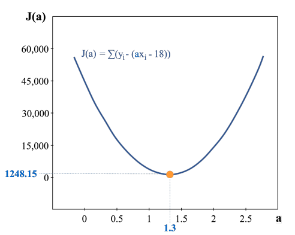

<i>Figure 6: Minimum point in the cost function</i>

Figure 6 shows that for the value of $a$=1.3 has the lowest possible value of $a$ in our dataset.

#### 7.1.3 Gradient Descent Algorithm
Now, we have to identify the best model, which is the model that produces the least possible value of the *cost function*. Mathematically,

$$
\begin{align}
a^*&=\underset{a}{\arg \min} \hspace{3pt} J(a) \\
&=\underset{a}{\arg \min}\sum_{i=1}^{n}(y_i-\hat f(x_i))^2
\end{align}
$$
Where, $a^*$ is the value of $a$ that gives minimum cost from the function $J(a)$.

In our case, $a^*$ = 1.3

In this section, we will learn how to find the minimum possible value of $a$ using the *gradient descent algorithm*.

In high level, a *gradient descent algorithm* starts with a random value of parameter $a$. It then finds the direction in which the function decreases the fastest and takes a *step* in that direction. It repeats the process of finding the direction of steepest descent and taking a step in that direction until it converges to the minimum value of the function.

**<u>Gradient Descent (with a single parameter)</u>**
1. Choose fixed learning rate $l$
2. Initialize the parameter $a$ to an arbitrary value
3. While termination condition is not matching,
	- Compute $\frac{\partial y}{\partial x}$, derivative of cost funcion $J$ at value $a$.
	- Take a step in the gradient direction scaled by the learning rate $l$.
$$a_i=a_{i-1}-l\cdot \frac{\partial x}{\partial y}$$

**<u>Gradient Deviation</u>**
Gradient of the cost function $J(a)$,

$$
\begin{align}
J(a)&=\sum_{i=1}^{n}(y_i - (ax_i - 18))^2 \\

\frac{\partial J}{\partial a} &= \frac{\partial}{\partial a} \cdot \sum_{i=1}^{n}(y_i-(ax_i-18))^2 \\

&=\sum_{i=1}^{n} \cdot -2x_i(y_i-(ax_i-18))^2

\end{align}
$$

Now, we illustrate the derivation of the gradient of the cost function at the current value of $a$.

First, we expand the cost function for the data points,
$$J(a)=(31-(a\cdot 30-18))^2+(30-(a\cdot 46-18))^2+...$$
Now, we apply basic property of derivatives -- derivative of a sum of terms is equal to the sum of derivatives of the terms.

$$\frac{\partial J}{\partial a}=\frac{\partial}{\partial a}\cdot (31-(a\cdot 30-18))^2+ \frac{\partial}{\partial a}\cdot(30-(a\cdot 46-18))^2+...$$

Next, we calculate the derivative in each term, we apply the chain rule yielding,

$$\frac{\partial J}{\partial a}=(-2.30)\cdot(31-(a\cdot 30-18)) + (-2.46)\cdot (30-(a\cdot46-18))+...$$

**<u>Initialization and First Iteration</u>**
Now, lets see how the gradient descent algorithm works on our example. The algorithm initializes the parameter $a$=0, corresponding to the initial model $\hat f(x)=0\cdot x-18$. The gradient of the cost function at the current point $a$=0 is, $\frac{\partial J}{\partial a}=-67218$.

In other words, when $a$=0, the slope of the curve is equalt to -67218 as illustrated in Figure 7.

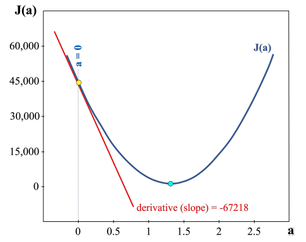

<i>Figure 7: Derivative at the first iteration</i>

Then, we use gradient to update the parameter $a$,
$$a_{new}=a-\frac{\partial J}{\partial a}\cdot l$$

Note that the learning rate is usually set to a small value, such as $l=0.00001$. Now, the new value of $a$ can be calculated by,

$$
\begin{align}
a_{new}&=0-(-6.7218)\cdot(0.00001) \\
&=0.67218
\end{align}
$$

**<u>Second Iteration</u>**
$$
\begin{align}
\frac{\partial J}{\partial a}&=(-2.30)(32-(0.67218\cdot30-18))+...  \\
&=-32540.2338
\end{align}
$$

Then, 
$$
\begin{align}
a_{new}&=0.67218-(-32540\cdot 2338)\cdot (0.00001) \\
&=0.99758
\end{align}
$$

**<u>Third Iteration</u>**
$$\frac{\partial J}{\partial a}=-15752.7272$$
$$a_{new}=1.15511$$

**<u>Additional Iteration and Termination</u>**

| Iteration | $\frac{\partial J}{\partial a}$ | Step size | $a$     |
| --------- | ------------------------------- | --------- | ------- |
| 1         | -67218.0000                     | -0.67218  | 0.67218 |
| 5         | -3691.6959                      | -0.03692  | 1.26829 |
| 10        | -98.1525                        | -0.00098  | 1.30201 |
| 13        | -11.1354                        | -0.00011  | 1.30282 |
| 15        | -2.6096                         | -0.00003  | 1.30294 |

The closer we get to the optimal value of $a$ the smaller the step size gets. Furthermore,  at the minimum value of $a$ the derivative is exactly equal to $0$, hence, the step size is exactly equal to $0$ and then the gradient descent algorithm terminates.

In parctice, the gradient descent algorithm will never obtain the exact optimum and exactly $0$ gradient. Instead, we provide a threshold for when the gradient descent algorithm terminates. For example, if we choose to terminate when the absolute value of a step size is less than $0.00005$, then the iteration terminates at $15^{th}$ iteration. 
Another possible termination condition is to pre-specify a number of gradient descent iterations.

**<u>Different Initialization</u>**
Even if we specify a different initialization point we will still eventually find the optimum value.

**<u>Learning Rate</u>**
It is imperative to choose an appropriate learning rate. Choosing excessively small step size may lead the algorithm to converge slowly — which increases the processing time and choosing excessively large learning rate will cause the algorithm to jump back and forth the optimum value many times unnecessarily.

**<u>Stochastic Gradient Descent</u>**
The gradient descent algorithm that we learnt is called *batch gradient descent*. Since, we have to touch all the data points in the batch, the cost of touching each data point is very large.

The *Stochastic Gradient Descent(SGD)* algorithm utilizes a low-cost approximation to the gradient. It touches only a single data point.

$$\theta := \theta-\triangledown_\theta J(\theta; x_i, y_i)\cdot l$$

At a data point index $i$, where $i$ is choosen randomly at each iteration. Since, the datapoint is choosen at random, each datapoint will eventually participate in the learning process.

However, the gradient at a single point might be an inaccurate representation of full data-set. In practice, to maintain both speed and accuracy the gradient is computed in a *mini-batch* consisting $k>1$ samples. Where $k$ is a hyper-parameter typically between $k=10$ to $k=1000$. The mini-batch update is,

$$\theta=\theta-\triangledown_\theta J(\theta; x_{i:i+k-1};y_{i:i+k-1})\cdot l$$

#### 7.1.4 Gradient Descent with More Parameters
If both parameters $a$ and $b$ are unknown, we can use the previous algorithm with slighht modification to compute $a$ and $b$.

Gradient with respect to the parameter $a$ when $b$ is held fixed,
$$\frac{\partial J}{\partial a}=\sum_{i=1}^{n}2\cdot x_i\cdot(y_i-(ax_i-b))$$

Gradient with respect to the parameter $b$ when $a$ is held fixed,
$$\frac{\partial J}{\partial b}=\sum_{i=1}^{n}-2\cdot(y_i-(ax_i-b))$$

In higher dimentional cases, the cost-function cannot be visualized easily. However, the gradient descent algorithm can be applied in just thhe same way.

### 7.2  Gradient Descent in Other ML Model
Gradient Descent algorithm is not specific to this particular model or cost functions. Different types of ML Models i.e Neural Networks  produce different types of optimizaion problem but still the Gradient Descent algorithm can be applied to it. The main goal of Gradient Descent Algorithm is to find the driection of the steepest descent and take a step towards it.

**Convex and Non-convex Cost Function**
When plotted, a convex cost function is oriented upwards, which looks like a half circle or an oval, while non-convex cost function hhas at least one interior angle that is greater than $180\degree$. 

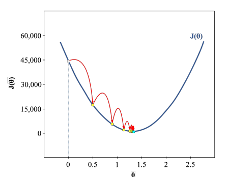

<i>Figure 8: Gradient Descent on Convex Function</i>

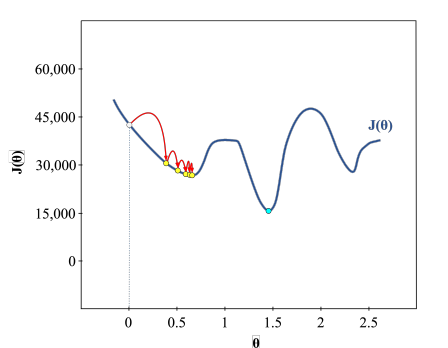

<i>Figure 9: Gradient Descent on Non-convex Function</i>

For non-convex cost function with two parameters, there are 3 types of critical points that have gradient 0, and thus relavent to the optimizaion
- Saddle Point &rarr; Plateu-like regions
- Local Minima &rarr; Smallest values of the function within a specific range
- Global Minima &rarr; Smallest values of the function within the whole domain.

The objective of the Gradient Descent is to find the optimal value, which is any global minimum point.

#### 7.2.1 Getting Stuck in a Local Minimum
One of the solutions to get out of the local minima is to increase the learning rate, because of larger step size, it increases the probablity of not getting stuck in a local minima.

However, choosing very high learning rate can lead to another problem — overshooting global minimum.

#### 7.2.2 Overshooting Global Minimum
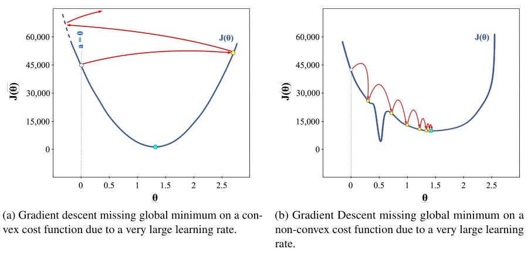

In reality, there is no exact solution to this problem. But there are different methods that have proven to work well in finding the global minimum or move to better local minimum. These methods are:
- Using another Gradient Descent Algorithm such as (Stochastic Gradient Descent, Mini Batch Gradient Descent, Momentum-based Gradient Descent, Nesterov Accelerated Gradient Descent)
- Using different step size by adjusting the learning rate.

#### 7.2.3 Non-differentiable Cost Function
Gradient Descent requires taking the derivative of the cost function. However, we should keep in mind that not all functions are differentiable.

## 8. Basis Expansion and Regulation
This chapter focuses on modifying the regression and the cost function as a way to change its complexity.
### 8.1 Basis Expansion
Basis expansion is a powerful technique which adds non-linear features into the model. Then linear regression can be applied directly into the dataset to learn the coefficient of the non-linear term.

#### 8.1.1 Polynomial Basis Expansion
We have train and test data of housing with area as feature and price as target variable. We will now learn a polynomial model instead of linear model. 

The degree of polynomial is the largest power of $x$ in the function $f(x)$. So, a $n^{th}$ degree polynomial can be represented as,

$$f(x)=w_0+w_1x+w_2x^2+...+w_nx^n$$

Where, $w_x$ is a real-value (eg. w=5)

Now, we will create and fit 3 different degree of polynomial functions. For each polynomial,
- Fit the function to the training set
- Use the function to predict values for training and testing data set
- Use the predicted values to calculate the SSR for train and test dataset.

**Second-Degree Polynomial**
Lets fit a second degree polynomial function $f(x_i)=w_0+w_1x_i+w_2x_i^2$.

Now, we have to find the minimum values of $w_0, w_1, w_2$ parameters.

$$\underset{w_0,w_1,w_2}{\min} \sum_{i=1}^{n}(y_i - (w_0+w_1x_i+w_2x_i^2))^2$$

Now, we use gradient descent to find the weights that give the minimum SSR.

Final weights will be, $w_0=3.19, w_1=-0.5, w_2=0.014$.

Check our model for datapont $a$,

$$
\begin{align}
\hat f(x_a)&=w_0+w_1x_a+w_2x_a^2 \\
&=31.9-0.5\cdot 30+ 0.014\cdot (30)^2 \\
&= 29.5
\end{align}
$$

So, $x_a=295,000$ and $y_a=310,000$. Therefore, Error = $15,000$

Now, calculate the $SSR_{training}$

$$
\begin{align}
SSR_{training}&=\sum_{i=1}^{n}(y_i-\hat f(x_i))^2 \\
&=1027.0004
\end{align}
$$

For the test set, 
$$SSR_{test}=1757.08$$

Model performed approximately five times worse for the test set.

**Fourth-degree and Fifth-degree Polynomial**

| degree | $SSR_{training}$ | $SSR_{test}$ | $\sum \lvert w_i \rvert$ |
| ------ | ---------------- | ------------ | ------ |
| 4      | 688.66           | 29379.05     | 945.20 |
| 5      | 0.6              | 6718669.7    | 21849.22      |

#### 8.1.2 Comparision of Model Weights
Higher the polynomial degree higher the weight terms $w$.

### 8.2 Regularization 
The technique to decrease the complexity of a model is called *regularizaion*. In other words, we decrease the sum of weights which are higher in higher degree polynomial. Regularizaion constructs a *penalized loss function*.

$$L_\lambda(w;X,Y)=L_D(w;X,Y)+\lambda \cdot R(w)$$
Where,
- $L_D$ &rarr; Data loss function thet measures goodness-of-fit
- $R_w$ &rarr; Penalty term thhat penalizes complex models
- $\lambda \ge 0$ &rarr; Parameter that controls strength of penalty

#### 8.2.1 Ridge Regression
$$R(w)=\sum_{j=1}^{d}w_j^2$$

$R(w)$ or $L2$ computed the sum of squared values of the weights $w_i$.
When,
- $\lambda = 0$ &rarr; No effect
- $\lambda$ is close to $0$, Model is close to the Ordinary Least Square(OLS) solution.
- $\lambda \to \infty$ &rarr; penalty term dominates data term

$$SSR_{L2}=\underset{\lambda \ge 0}{\arg \min}\sum_{i}(y_i-\hat f(x_i))^2 + \lambda \sum_{j=1}^{k}w_j^2$$

#### 8.2.2 Choosing Regularization Strength $(\lambda)$

$$\lambda^*=\underset{\lambda}{\arg \min}\hspace{5pt} \mathscr{L}(f_\theta(x_i),y_i) $$

Learning is then performed with restricted loss function,

$$\theta_\lambda^*=\underset{\theta \in S_\lambda}{\arg \min} \sum_{i=1}^{n} \mathscr{L}(f_\theta(x_i), y_i)$$
Where,
- $\lambda$ &rarr; Set of hyper-parameters
- $S_\lambda$ &rarr; Set of allowable models restricted to these hyperparameters

#### 8.2.3 Lasso Regression

$$R(w)=\sum_{j=1}^{d}\lvert w_j\rvert$$

## 9. Model Selection
In this chapter, we discuss about two models which helps in finding the optimal balanced model which neither underfits nor overfits the data.

### 9.1 Bias-Variance Decomposition
At high level, Bias-Variance Decomposition decomposes error as:

$$
\begin{align}
Error&=Irreducible \hspace{3pt}Error + Reducible \hspace{3pt}Error \\
&=Irreducible \hspace{3pt}Error + (Bias \hspace{3pt}Error + Variance \hspace{3pt}Error)
\end{align}
$$

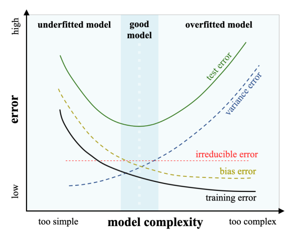

<i> Figure 11: Model error as a function of model complexity</i>
 

- **Irreducible Error:** Errors which inherit in the problem which cannot be reduced by any model.
- **Reducible Error:** Errors which can be reduced by a model.
	- **Bias Error:**  Bias error is large when model has low complexity, then the error monotonically decreases as the model complexity increases. It indicates the extent to which a model underfits a data.
 
	- **Variance Error:** Variance error is small when the complexity of the model is low. However, the error increases as the complexity of the model increases. It indicates the extent to which a model overfits  a data.

#### 9.1.1 Mathematical Definition of Bias-Variance Decomposition
We assume the response variable $y$ can be written as $y=f(x)+\varepsilon$ for a given input vector $x$.

Where, 
- $f$ &rarr; true deterministic function
- $\varepsilon$ &rarr; noise random variable with mean zero
- $\sigma$ &rarr; variance(representing irreducible error)

The Bias-Variance Decomposition analyzes the mean-squared error of a function $\hat f$ fit to finite sample of $n$ training points. It measures the error by taking an average of the fit $\hat f$ over random dataset with size $n$. It is written as,

$$MSE=E[(y-\hat f(x))^2]$$

Where,
- $E$ &rarr; Expection operator averages over everything that is random in the ift — all possible training set size $N$ and noise in response variable.

We then write, 

$$
\begin{align}
E[(y-\hat f(x))^2+\varepsilon]&=E[((f(x)+\varepsilon)-\hat f(x))^2]\\
&=E[((f(x)-\hat f(x))+\varepsilon)^2]
\end{align}
$$

Then, we isolate the reducible and irreducible components of the error by,

$$
\begin{align}
E[((f(x)-\hat f(x))+\varepsilon)^2]&=E[(f(x)-\hat f(x))^2]+2E[f(x)-\hat f(x)\cdot\varepsilon]+E[\varepsilon^2]\\
&=E[(f(x)-\hat f(x))^2]+2E[f(x)-\hat f(x)]\cdot\underbrace{E[\varepsilon]}_{=0}+\underbrace{E[\varepsilon^2]}_{=\sigma^2}\\
&=\underbrace{E[(f(x)-\hat f(x))^2]}_{reducible\hspace{3pt}error}+\underbrace{\sigma^2}_{irreducible\hspace{3pt}error}
\end{align}
$$

Reducible error can be further decomposed into bias and variance error component,

$$
\begin{align}
E[(f(x)-\hat f(x))^2]&=E[((f(x)-E[\hat f(x)])-(\hat f(x)-E[\hat f(x)]))^2]  \\
\end{align}
$$

Where, we subtracted $E[\hat f(x)]$ from one term and added it to another inside parenthesis.
Then,

$$
\begin{align}
&=\underbrace{[(f(x)-E[\hat f(x)])^2]}_{Bias(\hat f(x))^2}+ \underbrace{E[\hat f(x)-E[\hat f(x)])^2]}_{Var(\hat f(x))}-2E[(f(x)-E[\hat f(x)])\cdot(\hat f(x)-E[\hat f(x)])] \\
&=Bias(\hat f(x))^2 + Var(\hat f(x))-2(f(x)-E[\hat f(x)])\cdot \underbrace{(E(\hat f(x)-E[\hat f(x)]))}_{=0} \\
&=Bias(\hat f(x))^2 + Var(\hat f(x))
\end{align}
$$

Therefore, we have,

$$
\begin{align}
MSE&=\underbrace{E[f(x)-\hat f(x))^2]}_{Reducible \hspace{3pt}error}+ \underbrace{\sigma^2}_{Irreducible \hspace{3pt}error} \\
&=Bias(\hat f(x))^2 + Var(\hat f(x)) + \sigma^2
\end{align}
$$

**Illustration:**
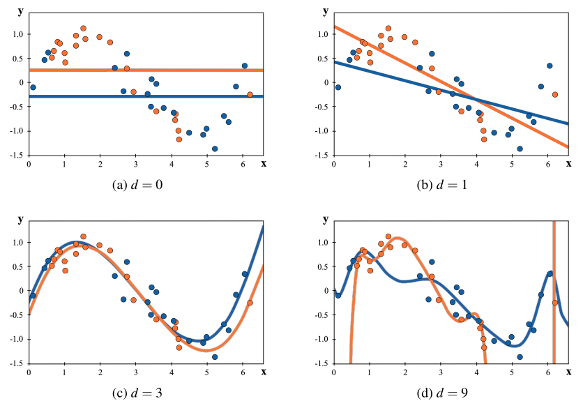

<i>Figure 12: Relationship of variance  with the model complexity</i>

Where,
- $d$ &rarr; polynomial degree

$\hat f^{orange}$ and $\hat f^{blue}$ are similar at low complexity and are very different for high complexity.

#### 9.1.2 Diagnosing Bias & Variance Error Sources
In a model, we often try to diagnose if its dominant error source is bias error or variance error. For example, these phrases are common to hear,
- “Increasing model’s accuracy on the training set” &rarr; We want to decrease bias & increase variance. We do this on the model we suspect to be undefitting. 
- “Making model more generic” &rarr; Decreasing variance and increasing bias. We do this if the model is overfitting.

Bias can be decreased by making model more complex, we can achiece this by, 
- Choosing a more complex functional for $n$ for $\hat f$. (e.g. higher degree polynomial)
- Develop better features from existing features
- Measure new features

Variance can be decreased by:
- Collecting and labeling more data.
- Feature selection(identify and drop irrelevant features).

### 9.2 Validation Method
In practical world, thhe bias & variance components cannot be measured directly. Therefore, we learn about the *empirical* methods to access our model’s performance.

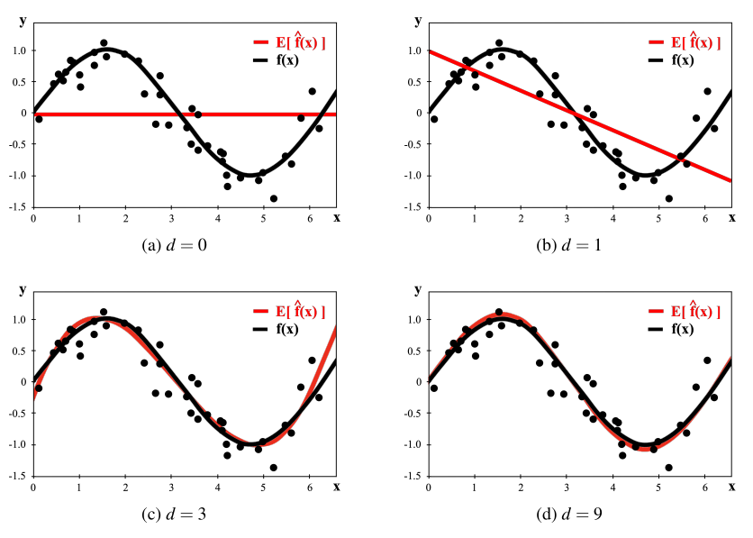

<i>Figure 13: Relation of the bias error to the model’s complexity. Bias error decreases as the model’s complexity increases</i>

#### 9.2.1 Hold-out Validation
In hold-out validation we split the data into training and testing set. Usually 80% training set and 20% testing set.

Two shortcomings of hold-out validation for small dataset:
- Losing data for model training
- Skewed training and test set: Maybe the data you seperated for testing may contain the highest values or the lowest values whichh may not propperly represent te range of values.

#### 9.2.2 Cross Validation
In cross validation, entire dataset is used for train and test purpose using the following cross validation methods.

**K-Fold Cross Validation:**
- First, randomly shuffle the dataset and split it into $K$ folds.
- For each unique fold,
	- One fold is made test data.
	- Other remaing folds are concatinated to make the train data.
	- Evulate te trained model on the test fold, score its score, & discard the learned model.
- Estimate the generalization performance of the model as, $\hat {err}=sum_{k=1}^K \hat {err}_k$, the average of errors on each folds.

**Leave-one-out Cross Validation:**
In extreme case, we can perform (LOOCV) which is equivalent to n-fold cross validation. Where we create only one data point as a test data and train $n$ number of models.

**Leave-p-out Cross Validation:**
In (LOOCV) we use one data point as testing set. However, in LpOCV we use a $p$ set of data as training set

### 9.3 Unrepresentative Data
Most of the machine learning algorothms algorithms assume that the data is independently and identically distributed(i.i.d). The data that violates i.i.d is called unrepresentative data.

## 10. Feature Selection
Feature selection is useful for tow reasons,
- It can prevent ML algorithms from learning learning co-relation with irrelevant features. i.e it reduces overfitting.
- It converts the features to human intrepretable model.

There are 3 different groups of feature selection techinques:
- Filter Methods
- Search Methods
- Embedded Methods

### 10.1 Filter Methods
Filter methods technique removes featurs before performing any learning. This technique computes a statistical measure of the relavance of each feature. The features are then ranked by their relevance score and either the top $K$ features or the features with score larger than the threshold $\tau$ are kept. Where, $K$ or $\tau$ is the user specified hyper-parameter.

Types of scores:
- **<u>Univariate Score</u>:**
A relavance score can be computed for each features individually. i.e without looking at other features.

- **<u>Multivariate Score</u>:**
It looks like for the interactions among features. The basic idea is to remove the highly co-related features. In extreme case both features are identical values for all datapoints.

#### 10.1.1 Univariate Score
There are multiple filter methods such as Chi-squared score etc. Here, we discuss the easiest one — *variance score*.

**Variance Score:**
In general, variance is the average of the square of the deviation from the mean.

$$variance = s^2 = \frac{\sum y^2}{n}$$
Where, $y$ &rarr; difference between a value and mean of all the values.

Variance for the feature $j$ would be,
$$Var(x_j)=\frac{\sum_{i=1}^{n}x_j}{n}$$

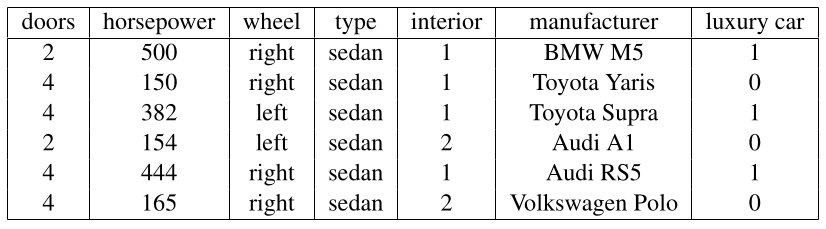

<i>Figure 14: Car dataset</i>

In the above dataset, we calculate the variance of the features and find out that the top 2 features in terms of variance score are *horsepower* and *torque*.

**Chi-square Score:**
Chi-square score is used in statistics to test the independence of two events. It assumes that both the features variable and target variable are categorical.

#### 10.1.2 Multivariate Selection
Here, we find out if one feature affects another

**Correlation-based Feature Selection:**
It calculates the correlation between each feature in the dataset and a target variable. It ranks features subsets according to a correlation based *heuristic evaluation function*. General idea is that we have to find features, that have high correlation with the *class* but are not correlated with each other.

**Fisher Score:**
Finding subset of features where the between-class variance of features should be large, while within-class variance of feature should be small.

For a given dataset $\{x_i, y_i\}_{i=1}^{N}$
Where, 
- $x_i\in R^M$ 
- $y_i\in \{1,2,...,c\}$, represents the class which $x_i$ belongs to.
- $N$ &rarr; Number of samples
- $M$ &rarr; Number of features
- $f_1, f_2, ..., f_m$ &rarr; $M$ features

The fisher score $F$ os the i-th feature $(f_i)$ is,

$$
\begin{align}
F(f_i)&=\frac{\sum_{k=1}^{c}n_k(\mu_i^k-\mu_i)^2}{\sum_{k-1}^{c}\sum_{y_i=k}(f_{i,j}-\mu_i^k-\mu_i^k)^2}\\
&=\frac{\sum_{k=1}^{c}n_k(\mu_i^k-\mu_i)^2}{\sum_{n_k}(\sigma_i^k)^2}\\
&=\frac{\sum_{k=1}^{c}n_k(\mu_i^k-\mu_i)^2}{\sigma_i^2}
\end{align}
$$

Where, 
- $n_k$ &rarr; number of samples in class $k$
- $\mu_i^k$ &rarr; mean of feature $f_i$ in certain k-th class
- $\sigma_i^k$ &rarr; standard deviation of feature $f_i$ in certain k-th class
- $f_{i,j}$ $rarr; value of feature $f_i$ in sample (or observation) $x_j$

**Finding best subset of features of size $K$:**
Let, 
- $algo$ &rarr; learning algorithm
- $X, y$ &rarr; training set
- $K$ &rarr; desired number of features 

For each subset $s$ of features of size $K$, learn a model with parameters using the proposed subset of feature $s$ with data matrix $X[:,s]$ & store the score in an array indexed by $s$.

$$score[s] \longleftarrow \underset{\theta}{min} \hspace{3pt}L(\theta;X[:,s],y)$$

Finally, return the subset $s$ with the best score from our array.

**Step Forward Feature Selection:**
Let, $s \leftarrow \emptyset$, represents the set of features we have selected(empty at first).
- For $i=1...K$
//Identifying the best features to add
- For $j \in \{1,...,p\} \textbackslash s$,
	- Let, $s' \leftarrow S \cup \{J\}$ be proposed feature set with feature $j$ added.
	- Fit a model using algo to the feature selected training set $X[:,s'],y$
	- Sotre the training error in an array score indesed by $s$.
- Identify the $j$ with the best score, and add $j$ to the feature set, i.e let $s \leftarrow S \cup \{J\}$.
- Return $s$, the best subset of features of size $k$ chosen via greedy step forward selection.

### 10.2 Search Methods
These methods are used to find the best possible subset of features of size $K$ for particular learning algorithm. However, these methods have a drawback — computation. 
To counter this instead of *exact search methods* we can use *approximate search methods*: *forward-selection* and *backward-selection* algorithms.

- **Step forward feature selection:** 
	- Start with empty set
	- At each iteration, identify the most relevant feature and add to the set.

- **Step Backward feature selection:**
	- Start with set of all features 
	- At each iteration, it identifies the least relevant feature and eliminates it form the set.

**Recursive Feature Elimination:**
It is same as Step-backward feature selection except for each iteration it may remove multiple features at once.

### 10.3 Embedded Methods
Embedded methods learn which features best contribute to the accuracy of the model while the model is being created.

## 11. Data Preparation
Methods of data pre-processing data:
- Data Cleaning
- Encoding
- Feature Engineering
- Feature Scaling
- Class Label Imbalance

### 11.1 Data Cleaning
#### 11.1.1 Dirty Data
**Incorrect Data:**
Clearly incorrect data such as *spelling* or *syntax errors*. If “california” is spelled “California” in some columns then they will be treated differently by the model.

One way to find out the spelling error in a column is by looking at the set of unique characters in that column.

**Improperly Formatted Data:**
Standardizing the format of data such as date is essential. The model will treat date with sufficient format differently.

E.g: 19-05-2020 and 10/05/2020 will be treated differently.

**Duplicated Data:**
Duplicate rows can lead the model to perform poorly. However, some duplicate data may be genuine. There is no way to know if the duplicate data is genuine except using the external sources by looking if two purchases were in fact made from the same place and same product has been bought in the same day.

**Irrelevant Features or Data:**
- **Irrelevant Features(Columns):**
	The data set of purchase history may contain which browser the user used to order the item. This information is irrelevant to the prediction task. 
- **Irrelevant Rows:**
	Suppose the task is to predict the purchase history of US but the data set contains the data of other countries as well which is irrelevant to the prediction task.

**Missing Data:**
If there are less number of missing value data points then we can remove the entire data point.

However, filling the missing value with a “good” value is more desirable. There are two data filling procedures 
- **Exact**:
	If  an address is missing but we have ZIP code we can fill the exact address with the help of ZIP code

- **Imputed**:
	For numeric data, typically the mean or the median of the non-missing values of the feature is used.

For categorical value, we use mode or most likely value.

In some case, a feature named `order_total_was_missing` can be created which includes binary value—provides more information to the learning algorithm which may help for good prediction.

#### 11.1.2 Outliers
A single data point or observation which is significantly different from other observations.

In normal distribution, a feature value $x_j^i$ with value $x_j^i \lt \mu^{(j)} -k\cdot\sigma^{(j)}$ or $x_j^i \gt \mu^{(j)} + k \cdot \sigma^{(j)}$ is considered as outlier. Typically $k=3$ is chosen.

If the column cannot contain a negative value then the observations outside $(\mu_3\cdot\sigma)$ would be considered outlier.

### 11.2 Feature Transformation
Transform feature to understand form for the algorithm.

#### 11.2.1 Feature Encoding
Change string or categorical data into machine readable numerical format. For binary categorical variable (yes & no) use 0 & 1.

For non binary categorical variable map each category variable to  number such as 0, 1, 2, ….. . If the order of feature value is important than directly substituting the mapped value in place of the categorical variable is better.

However, if the order is not important then it is better to transform a categorical feature with $K$ categories into $K$ features. As shown in the table below, taking 1 for that category and 0 for all other categories for that feature’s column.

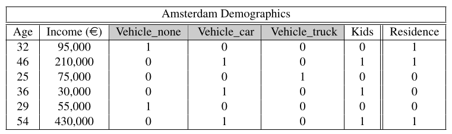

<i>Fig 15: Numerical encoding of categorical features</i>

#### 11.2.2 Feature Scaling:
Features which have much longer numerical values are changed or scaled or normalized. E.g. Salary feature contains large data such as &euro;30,000 to &euro;430,000.

Two popular data scaling approaches are:

- **Feature Standardization(z-scale normalization):**
In *Feature Standardization* feature value are re-scaled to have a mean of $\mu=0$ and standard deviation $\sigma=1$, 
i.e. standardized feature is calculated as,

$$x_i^{(j)}=\frac{x_i^{(j)}-\mu^{(j)}}{\sigma^{(j)}}$$

- **Feature Normalization:**
In *Feature Normalization*, the feature values are converted into specific range, typically between 0 and 1.

Normalized feature is calculated as,

$$\hat x_i^{(j)}=\frac{x_i^{(j)}-min^{(j)}}{max^{(j)}-min^{(j)}}$$

In many cases, standardization is used as default feature scaling method. But, we never know which to use unless we try both.

In some features which have outliers squeezing it to very small range can help with that.

### 11.3 Feature Engineering
#### 11.3.1 Feature Binning
Convert numerical(either continuous or discrete) feature into categorical feature represented by a set of ranges or bins.

E.g. Chopping `age` in different groups,

$young \in [25-34], middle \in[35-44], old\in[45-54]$

This process helps with overfitting.

Some popular binning methods are:
1. Equal width Binning
2. Quantile Binning
 
- **Domain Knowledge Binning:**

- **Equal Width Binning:**
Dividing the ranges of values of a feature into bins with equal width. Specify number of bins as hyper-parameter $K$. 

Then, width of each bin,
$$w=[\frac{max^{(j)}-min^{(j)}}{K}]$$

Then, the bins are,

$Bin1:[min,min+w-1]$
$Bin2:[min+w, min + 2w -1]$
$...$
$BinK:[min+(k-1)\cdot w, max]$

#### 11.3.2 Ratio Features
While engineering features, we can divide one feature with another feature to create a new feature.

For e.g. In a table we have two features `Customers` and `Visitors`. We can create a new feature `Conversion_ratio` by dividing `Customers` by `Visitors`.

$Conversion\hspace{3pt}Ratio = \frac{Customers}{Visitors}$

We can use conversion ratio feature to increase the performance of ML models.

### 11.4 Handling Class Label Imbalance
Suppose, we have a dataset of bank transfers. The target variable has two classes—`fraud` and `legal` transaction. If the amount of fraud transaction is extremely low compared to the legal transactions in the provided dataset then we can say that these two classes are imbalanced.

We call `fraud` to be *minority class* and `legal` to be *majority* class. Imbalanced classes can create problems in ML classification.

One of the ways to balance these classes is by using oversampling techniques.

#### 11.4.1 Oversampling
Oversampling technique tries to balance the minority and majority classes by artificially increasing the number of observations in the minority class.

We can increase the number of minority classes to match with the majority class by reusing the available minority class to match with the majority class as shown in Figure below.

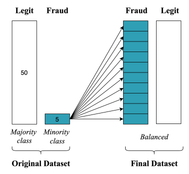

<i>Fig 16: Oversampling Minority Class</i>

Another method is called (SMOTE) whichh synthetically creates data for the minority class.

#### 11.4.2 Synthetic Minority Oversampling Technique(SMOTE)

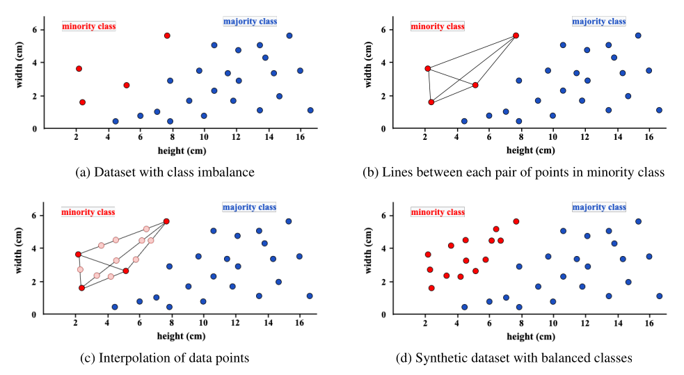

<i>Figure 17: Illustration of SMOTE algorithm to create a synthetic dataset with balanced classes</i>

In high level, the working of SMOTE algorithm is used by drawing lines between minority class data points and filling with randomly generated data points in between those data points.

