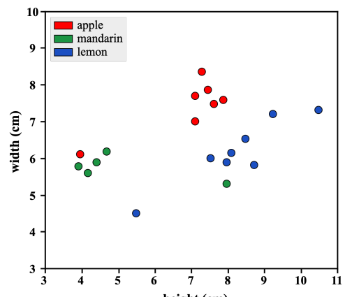

There are two types of problems in supervised learning:
- Regression
- Classification

#### 1. Classification:
In classification problems, an unknown category called *class label* is to be predicted. For example, a yes/no question is a classification problem because there are two possible outcomes either *yes* or *no*. Further, a yes/no question is also called a *binary classifiers* as there are only two possible *target variable*. However, if there are more than 2 *target variables*, it is called *multiclass classifiers*.

#### 2. Regression:
In regression, we try to predict an unknown number based on the set of known variables. For example, regression can be used to predict the price of a house based on the features i.e crime rate, ocean proximity, floor location, floor  etc. Here, the features such as crime rate, ocean proximity, floor location, floor size can be called as *input variables*. Furthermore, the value to be predicted can be called as *label* or *target variable* or *class label* or *output variable*. 

#### 3. Machine Learning Pipelines
There are 4 major steps in the machhine learning pipelines:

- Step I &rarr; Data Extraction
- Step II &rarr; Data Preparation
- Step III &rarr; Model Building
- Step IV &rarr; Model Deployment

#### 4. ML Pipeline: Example
Here, we are going to explain Step III by building a model that predicts the target variable -- type of a fruit -- based on its features -- height and width. We are given a synthetic table: 

| Height | Weight | Fruit Type |
| ------ | ------ | ---------- |
| 3.91   | 5.76   | Mandarin   |
| 7.09   | 7.69   | Apple      |
| 10.48  | 7.32   | Lemon      |
| 9.21   | 7.20   | Lemon      |
| 7.95   | 5.90   | Lemon      |
| 7.62   | 7.51   | Apple      |
| 7.95   | 5.32   | Mandarin   |
| 4.69   | 6.19   | Mandarin   |
| 7.50   | 5.99   | Lemon      |
| 7.11   | 7.02   | Apple      |
| 4.15   | 5.60   | Mandarin   |
| 7.29   | 8.38   | Apple      |
| 8.49   | 6.52   | Lemon      |
| 7.44   | 7.89   | Apple      |
| 7.86   | 7.60   | Apple      |
	|3.93 | 6.12 | Apple |
	| 4.40 | 5.90 | Mandarin |
	| 5.50 | 4.5 | Lemon |
	| 8.10 | 6.15 | Lemon |
	| 8.69 | 5.82 | Lemon |

##### 4.1. Problem Representaion
There are two *features* present in our dataset -- height and width. The features is represented by $y$. In our case, $y=2$. These features can be represented by the vector $x=(x^{(1)},..x^{(p)})$. The superscript $x^{(j)}$ represents the $j^{th}$ input feature. The number of data points is represented by $n$. In the table above, there are twenty data points. So, $n=20$. And each datapoint is represented by $i$. Each data point $(i)$ is represented by the vector $x_i=(x_i^{(1)},..x_i^{(p)})$.

So, the vector for the $3^{rd}$ data point can be represented as:
$$x_3=(x_3 ^{(1)},x_3 ^{(2)} )=(10.48,7.32)$$

The *target variable*$(y)$ takes discrete set of values. In our case, $y \in \{Mandarin, Apple, Lemon\}$. The *output variable*$(y)$ of $i^{th}$ data point is represented as $y_i$. In our table, the output variable of $3^{rd}$ data point can be represented as:
$$y_3 = Lemon$$

##### 4.2. Data Visualization
For classification problem with two *input variables* it is often visualized with a ***scatter plot***. 

<i>Figure 1: Scatter-plot</i>

<u>For the scatter plot:</u>
- $x-axis$ &rarr; 1st Feature
- $y-axis$ &rarr; 2nd Feature
- $i^{th}$ data point &rarr; each dot $(x_i^{(1)}, x_i^{(2)})$ colored according to the class label.

##### 4.3. Learning Prediction Function
Our prediction is carried out by the function we define $f$. Different algorithms corresponds to the different type of prediction function. We focus on KNN algorithm for now. 

KNN classifies a new point $x$ by finding the $k$ points in the training data that are neareset to the point $x$. Then, it will choose class $y$ for each point $x$ as the most popular class among these nearest point.

In our case, we are going to give $k=1$ which will calculate 1 nearest neighbour and classify $x$ as of that class. 

##### 4.4. Visualizing the Decision Regions
In the aforementioned Figure 1, each region/cluster of the same color is called *decision region* for each class and the curve that makes up the boundary between these decision regions is called *decision boundary*.

#### 5. Evulating the Prediction Function
We start by defining a numeric metric that tells us how good a classifier function is on a data set. First, we evulate our classifier function on the dataset we trained it on and secondly, we test it on a new dataset.

We find out that our function performed exceptionally well on our training dataset. Which is not a realistic estimation of real world error. This problem is called overfitting.

##### 5.1. Loss Function
First, we find out that how well does our prediction function matches with the *true label* with a single number. Lets, calculate the *misclassification rate*$(L)$ by dividing the total number of misclassifications with the total number of data points$(n)$. 

$$L(f,X,Y)=\frac{1}{n}\sum_{i=1}^{n}[f(x_i)\neq y_i]$$

Here, 
- $X = \{x_i: i=1,..n\}$
- $Y=\{y_i: y=1, ..n\}$
- $L =$ Misclassification Rate
- [] $=$ 1 if True, 0 if False

**Note:** If [] is 1 then we find that the prediction function is incorrect.

##### 5.2. Evulating on Train Data
Evulating our prediction fucntion on the training dataset gives the *misclassification rate* $L(f,X,Y)=0$. Because, each $f(x_i)=y_i$. Therefore, $[f(x_i)\neq y_i]=0$ and $\frac0n$ is 0.

